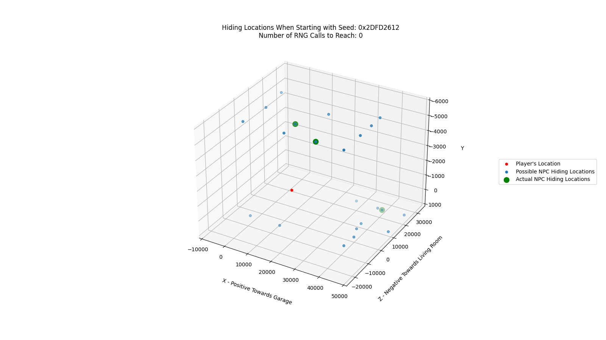

# Item Placement

This tools calculates the location of one or more objects given the current RNG value. This can currently only be done for a subset of objects that are useful for speedruns but provides the means to easily add additional objects in the future. This is done by reimplementing the algorithm used to place objects in the game world combined with dumps of the possible item locations. Currently only the following objects are supported:
* NPC Hiding Locations in *Chuckie's Glasses* - **glasses**
* Spike's location in *Let There Be Light* - **spike**

## Key Features
* 3D graph of the player character's location, all possible item locations, and the actual locations of the item(s) for a given seed
* The ability to start generation at an arbitrary seed passed in via decimal or hex string
* Sorting of resulting graphs by linear distance to object (ignores walls and other obstacles)
* Ability to filter out sub-optimal item placements

## Perquisites
* Python3
* matplotlib
* numpy

The quickest way to test the program is working is by running `python ItemPlacement.py -l glasses --display_graph`. This should generate and display a graph that looks like this:

## Usage
The first step in using this tool is determining the current RNG value. This can be done in many ways, but the [RNG](https://github.com/lazycurler/RugratsSearchForReptarResearch/tree/main/RNG) portion of this repository provides a Lua script to display the current value. The RNG value should be found immediately prior to triggering the object placement. For *Chuckie's Glasses*
this means the informational menu after the cutscene before the level. For *Let There Be Light* this means right before activating the fridge that causes a cutscene to be played. Once the current RNG value is found, it is possible to use the tool to display what the layout of objects will look like. Assuming the current RNG value was `0x12345678`, the following command could be used to see where Spike would be on *Let There Be Light*: `python ItemPlacement.py -l spike -x 0x12345678 --display_graph`

### Filtering and Sorting
Frequently, one desires to find the most ideal object layout within the next `N` RNG iterations. The number of RNG calls and subsequent iterations is provided by the `-i` argument. e.g. To generate 100 different object placements the option `-i 100` would be passed.

 The **--filter** option provides a means to filter out sub-optimal item placement using a level specific filter. A single default filter for each level is used, but advanced users are encourage to implement their own filters. This can be used by replacing the `placement_filter` member of the `LevelInfo` object.

Once sub-optimal objects layouts have been removed the `--sort N` option can be applied. The optional `N` parameter allows the user to filter out all but the top `N` object orientations. If `N` is not provided as part of `--sort` then all non-filtered layouts will be displayed.

For example, again assuming the current RNG value was `0x12345678` the top 3 optimal hiding location layouts out of the next 1,000 RNG iterations for *Chuckie's Glasses* could be found using the following: `python ItemPlacement.py -l glasses -x 0x12345678 -i 1000 --display_graph --sort 3 --filter`

Additional options and information can be found by providing the help option: `python ItemPlacement --help`